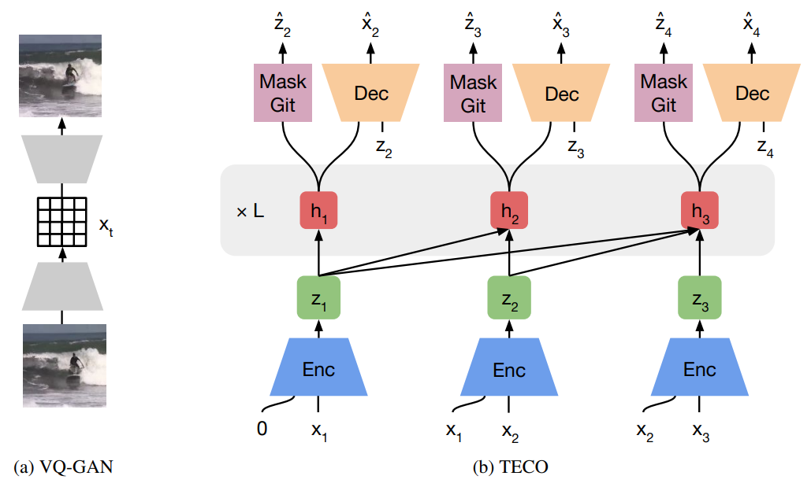

# Temporally Consistent Video Transformer for Long-Term Video Prediction

[[Paper]](https://arxiv.org/abs/2210.02396)[[Website]](https://wilson1yan.github.io/teco/index.html)

Generating long, temporally consistent video remains an open challenge in video generation. Primarily due to computational limitations, most prior methods limit themselves to training on a small subset of frames that are then extended to generate longer videos through a sliding window fashion. Although these techniques may produce sharp videos, they have difficulty retaining long-term temporal consistency due to their limited context length. In this work, we present \textbf{Te}mporally \textbf{Co}nsistent Video Transformer (TECO), a vector-quantized latent dynamics video prediction model that learns compressed representations to efficiently condition on long videos of hundreds of frames during both training and generation. We use a MaskGit prior for dynamics prediction which enables both sharper and faster generations compared to prior work. Our experiments show that TECO outperforms SOTA baselines in a variety of video prediction benchmarks ranging from simple mazes in DMLab, large 3D worlds in Minecraft, and complex real-world videos from Kinetics-600. In addition, to better understand the capabilities of video prediction models in modeling temporal consistency, we introduce several challenging video prediction tasks consisting of agents randomly traversing 3D scenes of varying difficulty. This presents a challenging benchmark for video prediction in partially observable environments where a model must understand what parts of the scenes to re-create versus invent depending on its past observations or generations.

## Approach


## Installation
Install Jax
```
# For GPU
conda create -n teco python=3.8
conda install -y cudatoolkit=11.3 cudnn
pip install --upgrade "jax[cuda]==0.3.21" -f https://storage.googleapis.com/jax-releases/jax_cuda_releases.html

# For TPU
pip install "jax[tpu]==0.3.21" -f https://storage.googleapis.com/jax-releases/libtpu_releases.html
```

Install the rest of the dependencies
```
sudo apt-get update && sudo apt-get install -y ffmpeg
pip install -r requirements.txt
pip install -e .
```

## Datasets
You can uses the scripts in `scripts/download` to download each dataset. Data is stored in Internet Archive, and you will need to first install the pip package: `pip install internetarchive`

We offer the following datasets (note that you will require 2x the dataset size due to downloading and untar-ing). :
* `dmlab.sh`: DMLab dataset with 40k trajectories of 300 64 x 64 frames - 54GB
* `dmlab_encoded.sh`: DMLab dataset pre-encoded using the VQ-GAN - 5.4GB
* `minecraft.sh`: Minecraft dataset with 200k trajectories of 300 128 x 128 frames - 210GB
* `minecraft_encoded.sh`: Minecraft dataset pre-encoded using the VQ-GAN - 27GB
* `kinetics600_encoded.sh`: Kinetics-600 pre-encoded using the VQ-GAN - 42GB

Run each script with: `sh scripts/download/<script>.sh <download_dir>`

Habitat download links coming soon.

You can collect your own data through the following links for [DMLab](https://github.com/wilson1yan/lab), [Minecraft](https://github.com/wilson1yan/collect-minecraft), and [Habitat](https://github.com/wilson1yan/collect-habitat). For Habitat, you will need to collect the 3D scenes yourself.

## Pretrained VQ-GANs

Pretrained VQ-GAN checkpoints for each dataset can be found [here](https://drive.google.com/drive/folders/10hAqVjoxte9OxYc7WIih_5OtwbdOxKoi?usp=sharing)

This repo does not have VQ-GAN training code, as we used [the original repo](https://github.com/CompVis/taming-transformers) and converted checkpoints from PyTorch to Jax.

## Pretrained TECO

Pretrained TECO checkpoints for each dataset can be found [here](https://drive.google.com/drive/folders/1k1O31RfE9_I_cvwQLENpYqsiAoVM8YQ3?usp=sharing)

## Training
Before training, you will need to update the paths to the corresponding configs files to point to your dataset and VQ-GAN directories.

For standard training, run:
```python scripts/train.py -o <output_folder_name> -c <path_to_config>```

For model-parallel training, run:
```python scripts/train_xmap.py -o <output_folder_name> -c <path_to_config>```

We use standard training for DMLab and Minecraft, and model-parallel training for Habitat and Kinetics. Note that the scripts are interchangeable - if you have enough device memory, you can run standard training on Habitat and Kinetics. Alternatively, you can run model-parallel training for DMLab and Minecraft (you may need to change update the `num_shards` argument in the config file)

## Sampling
Sample using the script below - it will save videos into `npz` files for evaluation in the following section

```python scripts/sample.py -h```

## Evaluation
For FVD evaluations run
```python scripts/compute_fvd.py <path_to_npz>```

For PSNR, SSIM, and LPISP run
```python scripts/compute_metrics.py <path_to_npz>```

## Copyright

THIS SOFTWARE AND/OR DATA WAS DEPOSITED IN THE BAIR OPEN RESEARCH COMMONS REPOSITORY ON 10/6/22.
